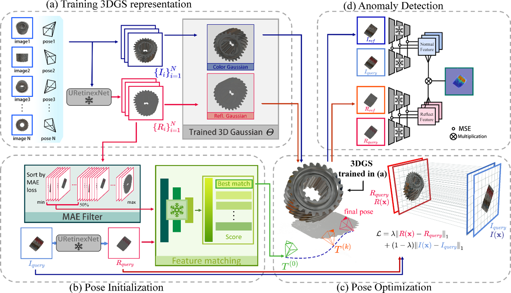

# PIAD: Pose and Illumination agnostic Anomaly Detection

## Poster
<p align="center">
  
</p>

## Abstract
*We introduce the Pose and Illumination agnostic Anomaly Detection (PIAD) problem, a generalization of pose-agnostic anomaly detection (PAD). Being illumination agnostic is critical, as it relaxes the assumption that training data for an object has to be acquired in the same light configuration of the query images that we want to test. Moreover, even if the object is placed within the same capture environment, being illumination agnostic implies that we can relax the assumption that the relative pose between environment light and query object has to match the one in the training data. We introduce a new dataset to study this problem, containing both synthetic and real-world examples, propose a new baseline for PIAD, and demonstrate how our baseline provides state-of-the-art results in both PAD and PIAD, not only in the new proposed dataset, but also in existing datasets that were designed for the simpler PAD problem. Source code and data will be made publicly available upon paper acceptance.*

## Overview
<p align="center">
  
</p>

The codebase has 4 main components:

- A PyTorch-based optimizer to refinement camera pose.
- A CUDA kernel that supports backpropagation of camera poses.
- A pre-trained network for camera pose initialization based on EfficientLoFTR.
- An anomaly detection module.

### Setup

#### Local Setup

First, you need to install the required packages. You can create a new conda environment (python=3.8) and then run:

```shell
pip install -r requirements.txt
```

And then download the pre-trained EfficientNet-B4 weights from the [PAD GitHub repository](https://github.com/EricLee0224/PAD) and put them in corresponding file location:

```
cd retrieval
gdown https://drive.google.com/uc\?id\=16FOwaqQE0NGY-1EpfoNlU0cGlHjATV0V
unzip model.zip
```

the file format is like this:

```
retrieval
 └ model 
```

Additionally, you will need to download the pre-trained weights for EfficientLoFTR. You can find the download link in their GitHub repository. The required file is `eloftr_outdoor.ckpt`, which should be placed in the `./EfficientLoFTR/weights/` directory.

the file format is like this:

```
EfficientLoFTR
 └ weights 
    └ eloftr_outdoor.ckpt
```

### Datasets

You can download the MAD dataset from the PAD GitHub repository, and it should be placed in `./data/LEGO-3D/`.  
You can download our dataset from [here](https://drive.google.com/file/d/13UjRuIQqg_gVAXxJf4T8PIj_QeJ204rD/view?usp=drive_link), and it should be placed in `./data/MIP/` (for synthetic data) or `./data/Colmap/` (for real data).
Alternatively, you can use the example data `Spring` and `05Joint`, which has already been placed in `./data/MIP/`and `./data/Colmap/`.

### Running (Pose Estimation)

To run the optimizer, simply use

```shell
python pose_estimation.py --config <path to config.txt> --class_name <class_name>
```

 The `pose_estimation.py` script first generates a set of reflection images and then trains 3DGS; these two steps are executed only during the initial run. Finally, it estimates the camera pose for each query image, renders the reference images, and saves the results to `./output`.

### Evaluation (Anomaly Detection)

To run the AD, simply use

```shell
python AUROC_TEST.py --obj <class_name>
```

it saves the results to `./AD_result`.

## Acknowledgement
This work is built on many amazing research works:
1. [3D Gaussian Splatting for Real-Time Radiance Field Rendering](https://github.com/graphdeco-inria/gaussian-splatting)
2. [PAD: A Dataset and Benchmark for Pose-agnostic Anomaly Detection](https://github.com/EricLee0224/PAD)
3. [URetinex-Net: Retinex-based Deep Unfolding Network for Low-light-Image-Enhancement](https://github.com/AndersonYong/URetinex-Net)
4. [Efficient LoFTR: Semi-Dense Local Feature Matching with Sparse-Like Speed](https://github.com/zju3dv/EfficientLoFTR)
## Project Page
Our Project Page is [[here](https://kaichen-yang.github.io/piad)](https://kaichen-yang.github.io/piad).
